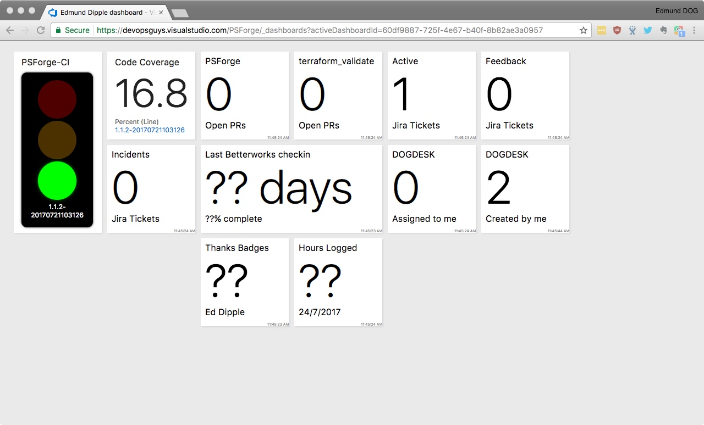

[Userstyles.org link](https://userstyles.org/styles/145627/hide-vsts-dashboard-menu-bar)

This style will hide the menu bar at the top of a VSTS dashboard. It will also hide the (+) button that allows you to edit the dashboard.

The point of this is so that you can display dashboards on TVs or projectors with the best usage of available space.

